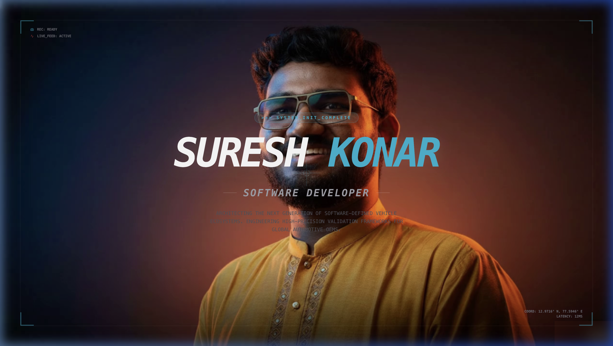
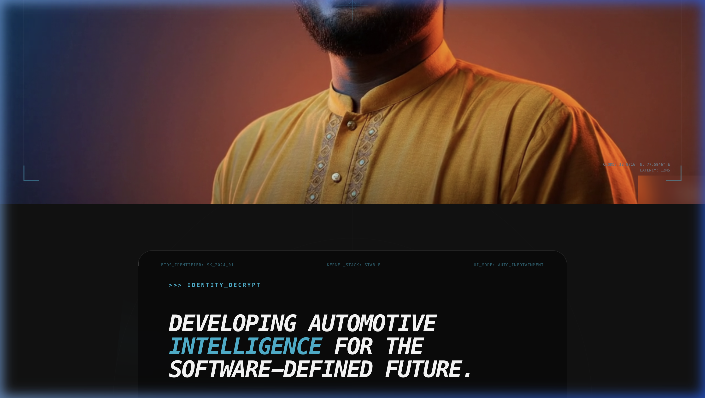
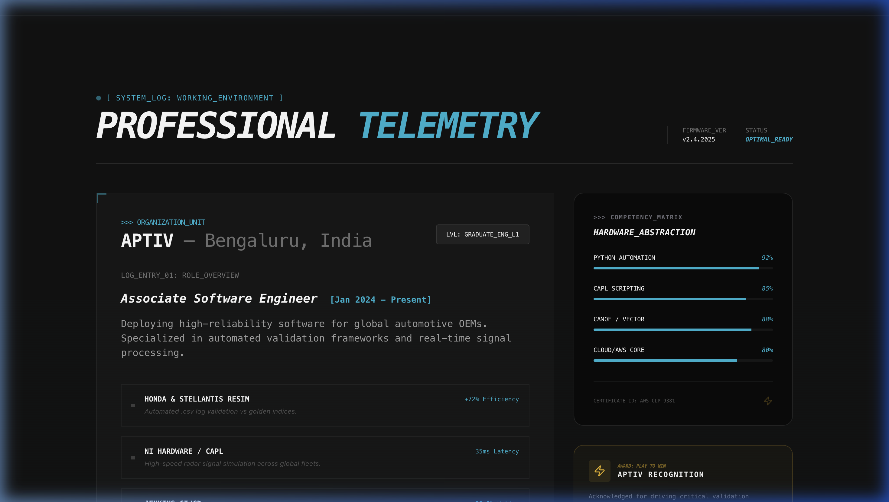
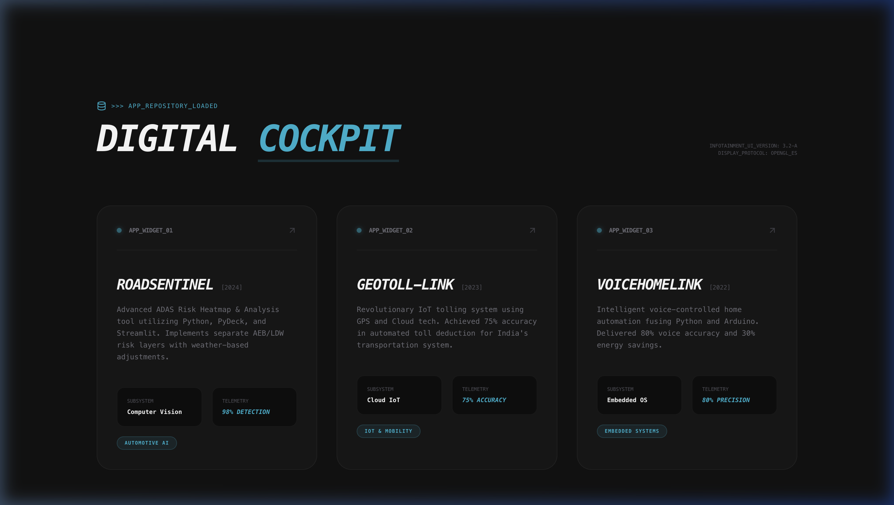
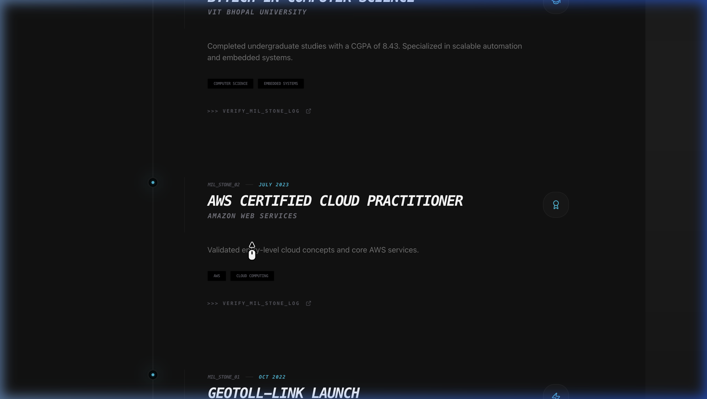
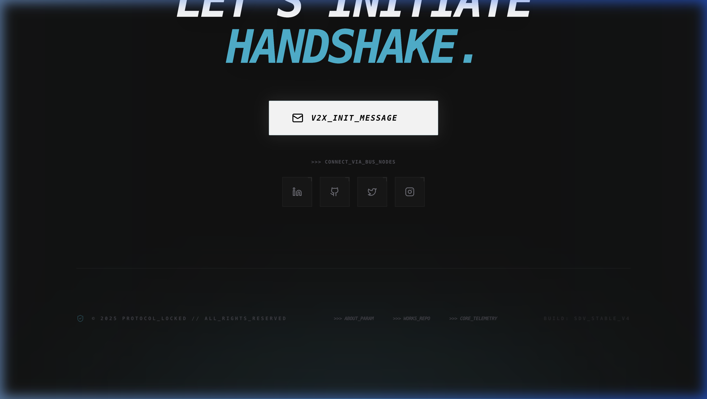

# Automotive HUD Portfolio



A high-end scrollytelling portfolio redesigned with a comprehensive **Automotive HUD (Heads-Up Display)** and **Digital Cockpit** aesthetic. This project bridges the gap between creative front-end design and system-level automotive engineering.

## 📺 Demo Walkthrough


## 🏎️ Design Aesthetic
The portfolio is built on a technical design language inspired by modern **Software Defined Vehicle (SDV)** interfaces:
- **Smart Camera HUD**: Responsive hero section with dynamic tracking overlays and system metadata.
- **Digital Cockpit Widgets**: Project showcases styled as glassmorphic infotainment units.
- **Professional Telemetry**: Experience section featuring skill abstraction matrices and data-driven performance metrics.
- **Fast Lane Timeline**: Mission-critical milestones visualized through high-beam light trails.
- **V2X Communication**: Contact section themed as a vehicle-to-everything handshake protocol.

## 🛠️ Technical Stack
- **Framework**: [Next.js 14](https://nextjs.org/) (App Router)
- **Styling**: [Tailwind CSS](https://tailwindcss.com/)
- **Animations**: [Framer Motion](https://www.framer.com/motion/)
- **Typography**: [Geist Mono](https://vercel.com/font/mono) (Standard Technical Monospace)
- **Icons**: [Lucide React](https://lucide.dev/)

## 📸 Component Showcase

### Identity Decrypt (About)

Technical profile visualization with radar scanning effects and parameterized credentials.

### Performance Telemetry (Experience)

Detailed career metrics and technical competency mapping for Embedded and Automotive systems.

### Digital Cockpit (Projects)

Interactive glassmorphic widgets displaying subsystem architecture and project telemetry.

### Light Trail (Timeline)

Sequential flow of hardware and software milestones with intense "High Beam" glow effects.

### Handshake Protocol (Contact)

Initiate a V2X connection message through a headlight-inspired beam interface.

## 🚀 Getting Started

First, run the development server:

```bash
npm run dev
# or
yarn dev
# or
pnpm dev
# or
bun dev
```

Open [http://localhost:3000](http://localhost:3000) with your browser to see the result.

---
**BUILD: SDV_STABLE_V4** | **PROTOCOL_LOCKED**
